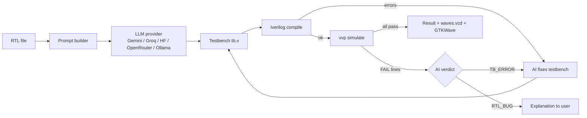

# AI Testbench Studio

**Upload RTL. An LLM writes the self-checking testbench. Icarus Verilog runs it. The AI debugs itself and tells you whether the testbench or your design is wrong.**

A desktop tool (Python + Tkinter) built for ForgeHacks 2026, track **AI + Education**.

## Problem
Writing a good testbench takes as long as writing the design, and beginners rarely know where to start. When a simulation fails, they cannot tell whether the testbench or the RTL is at fault. Many students and hobbyists skip verification and ship unverified hardware.

**Target users:** hardware/digital-design students, self-taught FPGA and RISC-V hobbyists, and instructors who need quick verification examples.

## Features
- Upload or paste Verilog/SystemVerilog (`.v`, `.sv`, `.vh`).
- AI generates a self-checking `tb` with clock/reset, directed corner cases, random vectors, VCD dump and a `SUMMARY: <p> passed, <f> failed` line.
- One-click compile (`iverilog -g2012`) and simulate (`vvp`) with colour-coded output.
- **Auto-fix loop:** compile/runtime errors go back to the AI, which repairs the testbench.
- **Verdict mode:** on failing checks the AI answers `TB_ERROR` (fixes the testbench) or `RTL_BUG` (explains the bug in your design).
- Guards against false confidence: flags simulations that end at t=0, hit the watchdog, or contain no checks.
- GTKWave launcher with an auto-generated signal list.
- Multiple providers: Gemini, Groq (free tier), Hugging Face, OpenRouter, or local Ollama (offline, no key).

## Architecture


## Setup (Windows)
1. Install Python 3.9+ and [Icarus Verilog](https://bleyer.org/icarus/) (tick "Add to PATH", include GTKWave).
2. Get an API key: [Gemini](https://aistudio.google.com/apikey) or [Groq](https://console.groq.com/keys) (free). Ollama needs no key.
3. Run (no pip packages needed; standard library only):
```powershell
python ai_tb_studio.py
```
If Icarus is not detected, use **Locate iverilog...** and pick `iverilog.exe`.

## Usage
1. **Upload RTL**, choose provider/model, paste the key (click the refresh button to list Gemini models your key can use).
2. **Generate TB + Simulate.** Watch the *Simulation output* tab.
3. Edit the testbench tab if you like and press **Run simulation**.
4. **Open waveform** to inspect signals in GTKWave.

Try the included examples in `demo/`:
- `alu8.v`: passes all checks.
- `buggy_decade_counter.v`: wraps at 10 instead of 9; the AI reports `RTL_BUG`.

## Project structure
```
ai_tb_studio.py          # the application
demo/alu8.v              # clean design
demo/buggy_decade_counter.v   # design with a planted bug
docs/                    # screenshots and architecture diagram
```

## Limitations
LLM output can be wrong: always review the testbench and the verdict. Simulations are capped at 90 s. Outputs are only as good as the model chosen.

## Hackathon
ForgeHacks 2026, track **AI + Education**: it teaches verification by showing a working testbench, live results, and plain-English explanations of failures.

## License
MIT
